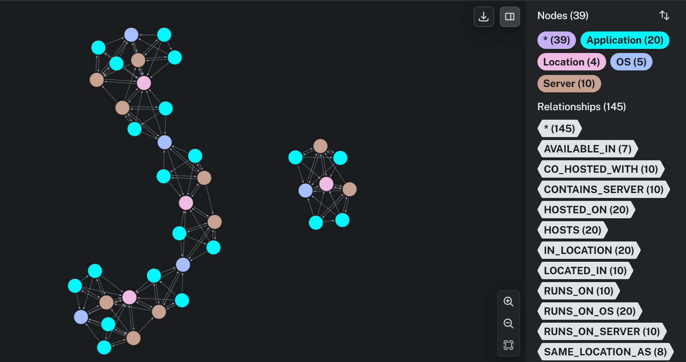

# README.md

## GraphRAG Chat Application

Natural language queries on Neo4j knowledge graphs using OpenAI LLM.

## Quick Start

### Neo4j Setup

### Backend
Run these commands:

`python -m venv venv`

Mac:

`source venv/bin/activate`

Windows:

`.\venv\Scripts\activate`

Then

`pip install -r requirements.txt`

`cd graphRAG-backend`

`cp .env.example .env` 

Populate your credentials in .env file that was just created

neo4j credentials can be retrieved from the neo4j instance that you created.

NEO4J_URI is the external URI that is provided by the neo4j instance

`python start.py` # First time: init DB

`python app.py` # Server on port 5000

### Frontend
`cd rag-chatbot`

`echo "REACT_APP_API_URL=http://127.0.0.1:5000" > .env`

`npm install`

`npm start` # App on port 3000

## Features
- Chat with knowledge graph in natural language
- Execute Cypher queries directly
- Vector search via embeddings
- 11 relationship types

## Example Queries
"Which servers run Ubuntu 22.04?" → Server 1 and Server 3

"What applications are on server1?" → Application 10 and Application 20

"Where is server5?" → New York

"Tell me about server2" → Ubuntu 20.04, hosts Application 1 & 11, in San Francisco

## Tech Stack
- React 18 | Flask | Neo4j | OpenAI GPT-3.5

## .env Files

**Backend**:
NEO4J_URI=NEO4J external URI 

NEO4J_USER=neo4j

NEO4J_PASSWORD=password

OPENAI_API_KEY=sk-...

**Frontend**:

REACT_APP_API_URL=http://127.0.0.1:5000

## Graph Schema

**Nodes**: Server (10) | Application (20) | OS (5) | Location (4)

**Relationships (11)**:
- Direct (3): HOSTS, RUNS_ON, LOCATED_IN
- Reverse (3): HOSTED_ON, RUNS_ON_SERVER, CONTAINS_SERVER
- Inferred (5): RUNS_ON_OS, IN_LOCATION, AVAILABLE_IN, CO_HOSTED_WITH, SAME_LOCATION_AS

## Troubleshooting
| Issue | Fix |
|-------|-----|
| Neo4j connection failed | Check .env credentials |
| API not responding | Flask on port 5000? |
| Frontend can't connect | Check REACT_APP_API_URL |
| OpenAI errors | Verify API key & quota |

**Clone → Setup .env → `python start.py` → `python app.py` → `npm start`** 🚀

# IMPORTANT
Be specific in the queries
"If want to request all applications that is ran on servers from a specific countries" mention all in the query
For instance:
Give all application in San Fransisco
